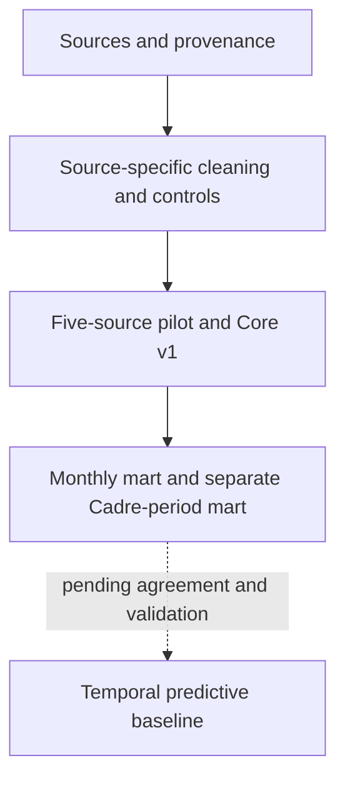

<p align="right">
  <strong>English</strong> · <a href="./README_ES.md">Español</a>
</p>

# Case study · Data for anticipatory action in Niger

> From fragmented humanitarian sources to a traceable, reproducible data architecture designed for multi-source analysis.

**Author:** Marta González Vázquez  
**Context:** internship at Action Against Hunger Spain · Digital Transformation  
**Role:** data analysis, auditing, methodological design and Python development  
**Status:** five-source pilot completed · Core v1 and Cadre exploratory work documented · temporal baseline and operational validation pending  
**Last updated:** 15 September 2026  
**Technologies:** Python · pandas · Jupyter · Power BI · DAX · Git · CSV/Parquet · APIs and open data

## The project in one sentence

I designed and developed a methodology to discover, audit, transform and integrate humanitarian and operational data sources for Niger without losing their granularity, traceability or meaning.

This case demonstrates how I work at the intersection of **operations, data quality, analytics and Python development**: understand the real problem first, formulate explicit rules and automate only what can be validated.

## Five-source pilot checkpoint

The pilot methodologically integrates five components—**Kobo, INFORM Risk, WFP Food Prices, INFORM Severity and Network Performance**—and is technically complete in the `develop` branch of the organisation's private repository.

| Completion evidence | Result |
|---|---:|
| Sources documented by layer | 5 |
| Reproducible notebooks | 7 (`00`–`06`) |
| Notebooks executed end to end | 7/7 |
| Execution errors | 0 |
| Cells without identifiers | 0 |
| Final `integration_analysis` tests | 15/15 |
| Tests validated across the project | 41/41 |
| INFORM Severity geographic-scope controls | 17/17 |
| Allocation rule | `value_propagated=False` · `allocation_method=NONE` |
| Geographic-scope change merged into `develop` | PR #8 · 7 September 2026 |
| Methodological commit merged into `develop` | `3115c13` |

Technical completion does not yet mean methodological approval by the supervisors or the existence of an operational early-warning system.

## Problem addressed

Data relevant to a potential anticipatory-action system is distributed across open-data portals, APIs, Excel files, Kobo surveys and Power BI semantic models. Each source uses different geographies, time periods, granularities and definitions.

Combining them without a rigorous methodology can:

- duplicate observations through many-to-many relationships;
- attribute subnational detail to sources that only have national coverage;
- confuse publication dates with actual reference periods;
- add together indicators with different meanings;
- hide coverage gaps through unjustified imputation;
- turn exploratory associations into apparent causal relationships.

The project's main rule is: **each source retains its native grain and is integrated only at a genuinely compatible geographic, temporal and semantic level**.

## My contribution

- Built a **Data Landscape** with 170 records and prioritised 14 logical sources for Core v1.
- Assessed 78 source-pair compatibility combinations.
- Designed an initial set of 12 dimensions and bridge structures for future integrations.
- Developed reproducible Python pipelines for INFORM Severity, INFORM Risk Niger and WFP Food Prices.
- Audited the Kobo and Network Performance Power BI models.
- Developed and validated the five-component pilot, keeping Network and INFORM Severity as independent layers where their grain did not support a direct join.
- Defined rules for quality, granularity, cardinality, coverage and privacy.
- Created seven reproducible notebooks, reusable modules, automated tests and decision traceability.
- Prepared a methodological foundation for reviewing the post-pilot architecture before building Gold or adding more sources.

## Verifiable results

### Data Landscape and design

| Indicator | Result |
|---|---:|
| Records catalogued | 170 |
| Logical Core v1 sources | 14 |
| Source-pair compatibility combinations assessed | 78 |
| Proposed dimensions and bridges | 12 |

### Sources included

| Component | Technical result | Validated use in the pilot |
|---|---|---|
| INFORM Global Crisis Severity | 92 XLSX resources audited, 89 canonical periods and `geographic_scope_v1` validated with 17/17 controls | Regional values may be associated with Admin2 units only as regional context; they are not propagated or presented as Admin2 measurements |
| INFORM Risk Niger 2024 | 8 Admin1, 67 Admin2 and 3,350 indicator records | Historical structural context; compatible integration with 62/62 Kobo groups |
| WFP Food Prices Niger | 50,962 observations, 79 markets and 10 commodities; 1990-01 to 2026-06 | Validated Silver layer and 79/79 markets linked to OCHA geography |
| Kobo / Power BI | 6,374 entries audited and 6,371 usable responses | 62 analytical groups; three documented technical exclusions |
| Network Performance / Power BI | 1,976 snapshots and 7 baseline–endline comparisons | Independent operational and contractual fact; no artificial territorial join |

### INFORM Severity geographic-scope update

On 7 September 2026, the `geographic_scope_v1` contract was validated and merged into `develop` through PR #8. It makes the geographic meaning explicit without publishing organisational code or source data:

- each severity value retains its native national or regional scope;
- an Admin2 unit may reference its parent region to retrieve regional context, but the value remains a regional measurement;
- no value is allocated, copied or converted into an Admin2 observation (`value_propagated=False`; `allocation_method=NONE`);
- 17/17 integrity and contract controls passed.

This makes regional context available in Admin2 analysis without creating false territorial precision.

### Kobo–INFORM–WFP pilot integration

| Control | Result |
|---|---:|
| Usable Kobo responses | 6,371 |
| Kobo analytical groups | 62 |
| Match with INFORM Risk | 62/62 |
| Groups with contemporary WFP coverage | 56/62 (90.323%) |
| ADM2–month pairs with contemporary WFP prices | 22/25 (88.0%) |
| ADM2 units with contemporary WFP coverage | 6/8 |
| WFP markets with OCHA geography | 79/79 |

These figures describe technical coverage and interoperability. The results are descriptive and exploratory: **they do not demonstrate causality, guarantee national representativeness or generate automated alerts**.

## Beyond the pilot: Cadre Harmonisé and statistical judgement

**Methodological update · 2 October 2026.** Subsequent work has documented Core v1, a monthly analytical mart and a separate food-security mart using **Cadre Harmonisé**, the regional framework for classifying acute food insecurity. The candidate outcome is the share of population in crisis or worse (phase 3 and above).

The two marts answer different questions. Operational and survey sources retain their own grains; the food-security analysis uses department × observed Cadre period. A Cadre observation is not copied into every month, and current assessments are separated from projections.

Conflict data produced by **ACLED**, accessed through the public aggregated **HDX HAPI** product, and rainfall data from **CHIRPS** are assessed as prior signals. **WFP prices**, **IOM displacement** and **INFORM Risk** remain relevant, with use conditioned on their temporal and geographic coverage. **INFORM Severity** remains national or regional context without conversion into departmental measurements.

Variables are selected by humanitarian meaning, grain, geographic compatibility, availability before the outcome, coverage and data quality. Exploratory analysis then examines associations, chance and multiple comparisons. Statistical associations support the next question to investigate; they do not establish causality or out-of-sample forecasting performance.

**Current limit:** the candidate outcome still needs operational agreement on horizon, output and action. Temporal baseline modelling and evaluation remain pending; this is not a deployed predictive alerting system.

This public summary describes methodological decisions only. It adds no new internal metrics, organisational code, datasets, beneficiary information or confidential results.

Methodology reference: [Cadre Harmonisé manual, CILSS/AGRHYMET](https://agrhymet.cilss.int/manuel-cadre-harmonise-version3-0/).

## Methodological architecture

**Current analytical status · 2 October 2026.** The earlier pilot checkpoint is retained above for traceability; the following diagram and table reflect subsequent documented work, without claiming production approval.



| Layer | Content | Current documented status |
|---|---|---|
| Bronze | Source files, metadata and provenance | Source-specific evidence retained |
| Silver | Types, keys, cleaning and quality controls | Pilot controls and subsequent secondary-source work documented |
| Integration | Contracts and relationships between compatible sources | Five-source pilot completed; Core v1 documented |
| Analytical marts | Monthly mart and separate department × observed Cadre-period mart | Documented for exploration; native grains and assessment/projection distinctions retained |
| Predictive use | Operational outcome, horizon, baseline and temporal evaluation | Agreement and validation pending; no operational predictive deployment |

## How it is built

Stable logic is separated from exploration:

```text
niger_anticipatory_action/
├── pipelines_etl/
│   ├── hdx-inform-severity-etl/
│   ├── inform-risk-niger-etl/
│   ├── wfp-food-prices-niger-etl/
│   └── network-performance-etl/
└── integration_analysis/
    ├── notebooks/
    │   ├── 00_metodologia_piloto_cinco_fuentes.ipynb
    │   ├── 01_kobo_inform_reproducible.ipynb
    │   ├── 02_wfp_kobo_inform_integration.ipynb
    │   ├── 03_wfp_geography_bridge_audit.ipynb
    │   ├── 04_network_performance_silver_audit.ipynb
    │   ├── 05_inform_context_layers_audit.ipynb
    │   └── 06_pilot_five_source_closure.ipynb
    ├── src/niger_integration/
    ├── scripts/
    ├── tests/
    └── docs/
```

- Notebooks are used for discovery, explanation and review.
- The `src/` modules contain reusable contracts, rules and evidence.
- Generators rebuild the methodological notebooks.
- A runner validates the complete notebook series from end to end.
- Tests protect geographic, temporal, contractual and aggregation decisions.
- Sensitive data and internal exports remain outside version control.

## Reproducible validation

The final validation of `integration_analysis` runs **15 tests** covering structure, contracts, metrics and integration rules. At the global checkpoint, the validated project suites reached **41/41 passing tests**.

Automated controls include:

1. row-count preservation and controlled geographic corrections;
2. consistency between date, month and reference period;
3. non-additive treatment of reference populations;
4. price lags based on exact calendar months;
5. market matching through normalised names;
6. monthly-price calculation using the retail median across markets;
7. validation of expected contracts and evidence across all five components;
8. verification of completion and coverage figures;
9. end-to-end execution of all seven notebooks without errors or cells lacking identifiers.

## Data-quality principles applied

1. Do not invent geographic codes or matches.
2. Do not propagate national or regional values to lower-level geographic units.
3. Do not join facts at different grains without an explicit aggregation.
4. Do not automatically interpret every blank value as an error.
5. Do not combine indicator variants before validating their definitions.
6. Do not impute markets, periods or territories without evidence.
7. Preserve quarantines and selection decisions as part of the audit trail.
8. Distinguish exploration, descriptive evidence, association and prediction.

## Decisions that demonstrate professional judgement

- INFORM Severity regional values are available to Admin2 analyses only as parent-region context; they remain regional measurements and are never allocated or propagated to Admin2.
- INFORM Risk 2024 is treated as historical structural context, not as a contemporary monthly covariate.
- The absence of contemporary prices in Tahoua and Tillia remains visible and is not corrected through imputation.
- Network Performance retains its operational and contractual grain; it is not artificially disaggregated to ADM1 or ADM2.
- Kobo microdata, internal PBIX files, credentials and sensitive results are not published.
- The pilot is not presented as an operational early-warning system or a completed predictive model.
- Subsequent Core v1 and Cadre work is described separately from this pilot checkpoint; source-specific grains and semantics remain explicit.

## Privacy and project ownership

The operational project is developed in a private repository owned by **Action Against Hunger Spain**. This README is a portfolio presentation and does not reproduce organisational code, microdata, credentials, Power BI models or internal exports.

The personal publication is limited to methodology, architecture, aggregated results and technical learning that can be shared without compromising confidential information. Before expanding the public content, the applicable publication boundaries should be reviewed with the project owners.

## Status and next steps

- [x] Build the Data Landscape and define the 14 logical Core v1 sources.
- [x] Develop the reproducible pipelines included in the pilot.
- [x] Audit Kobo and Network Performance.
- [x] Build and validate the Kobo–INFORM and WFP–Kobo–INFORM integrations.
- [x] Document Kobo, INFORM Risk, WFP, INFORM Severity and Network by layer.
- [x] Validate `geographic_scope_v1` for INFORM Severity (17/17 controls) and merge PR #8 into `develop` without propagating regional values to Admin2.
- [x] Create and execute the seven reproducible methodological notebooks.
- [x] Pass the 15 final `integration_analysis` tests and close the pilot in `develop`.
- [ ] Obtain methodological review from the supervisors.
- [ ] Agree the operational use, forecast horizon and output for the candidate food-security outcome.
- [x] Document Core v1, common dimensions, facts, keys and controlled bridges.
- [x] Document the monthly analytical mart and the separate department–Cadre-period food-security mart.
- [x] Integrate Cadre Harmonisé and document exploratory analysis with prior conflict and rainfall signals.
- [ ] Progressively incorporate other compatible sources without rebuilding the completed ETLs.

- [ ] Execute a temporal baseline and evaluate performance on unseen periods before discussing predictive alerts.

## What this case demonstrates

This work does not start from a single technique or notebook. It starts from an operational question and builds a system of verifiable decisions around it.

It demonstrates my ability to:

- understand complex models, sources and constraints;
- translate functional needs into data rules;
- build reproducible Python pipelines and controls;
- audit quality, keys, cardinalities and coverage;
- design integrations without distorting the meaning of the data;
- turn methodological decisions into repeatable tests and evidence;
- communicate limitations, risks and actual status clearly;
- connect senior IT and operations experience with analytics and applied data science.

---

**Marta González Vázquez**  
Senior IT & Operations · Data Analytics · Data Quality · Python · SQL · Power BI

