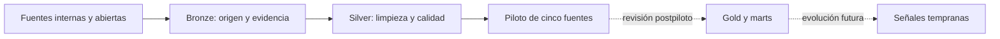

<p align="right">
  <a href="./README.md">English</a> · <strong>Español</strong>
</p>

# Caso de estudio · Datos para acción anticipatoria en Níger

> De fuentes humanitarias dispersas a una arquitectura de datos trazable, reproducible y preparada para análisis multifuente.

**Autora:** Marta González Vázquez  
**Contexto:** prácticas en Acción contra el Hambre España · Transformación Digital  
**Rol:** análisis de datos, auditoría, diseño metodológico y desarrollo Python  
**Estado:** piloto técnico de cinco fuentes cerrado · contrato de alcance geográfico de INFORM Severity validado · revisión metodológica pendiente  
**Última actualización:** 15 de septiembre de 2026  
**Tecnologías:** Python · pandas · Jupyter · Power BI · DAX · Git · CSV/Parquet · APIs y datos abiertos

## El proyecto en una frase

Diseñé y desarrollé una metodología para descubrir, auditar, transformar e integrar fuentes humanitarias y operacionales de Níger sin perder su granularidad, trazabilidad ni significado.

Este caso demuestra mi forma de trabajar en la intersección entre **operaciones, calidad de datos, analítica y desarrollo Python**: comprender primero el problema real, formular reglas explícitas y automatizar únicamente aquello que puede validarse.

## Resultado actual

El piloto integra metodológicamente cinco componentes —**Kobo, INFORM Risk, WFP Food Prices, INFORM Severity y Network Performance**— y está cerrado técnicamente en la rama `develop` del repositorio corporativo.

| Evidencia de cierre | Resultado |
|---|---:|
| Fuentes documentadas por capas | 5 |
| Notebooks reproducibles | 7 (`00`–`06`) |
| Notebooks ejecutados de principio a fin | 7/7 |
| Errores de ejecución | 0 |
| Celdas sin identificador | 0 |
| Pruebas finales de `integration_analysis` | 15/15 |
| Pruebas validadas en el conjunto del proyecto | 41/41 |
| Controles de alcance geográfico de INFORM Severity | 17/17 |
| Regla de asignación | `value_propagated=False` · `allocation_method=NONE` |
| Cambio de alcance geográfico integrado en `develop` | PR #8 · 7 de septiembre de 2026 |
| Commit metodológico integrado en `develop` | `3115c13` |

El cierre técnico no equivale todavía a validación metodológica por parte de los tutores ni a la existencia de un sistema de alerta temprana operativo.

## Qué problema resuelve

Los datos relevantes para un posible sistema de acción anticipatoria están distribuidos entre portales abiertos, APIs, archivos Excel, encuestas Kobo y modelos semánticos de Power BI. Cada fuente utiliza geografías, periodos, granularidades y definiciones diferentes.

Unirlas sin una metodología rigurosa puede:

- duplicar observaciones mediante relaciones muchos-a-muchos;
- atribuir detalle subnacional a fuentes de alcance nacional;
- mezclar fechas de publicación con periodos reales de referencia;
- sumar indicadores con significados diferentes;
- ocultar falta de cobertura mediante imputaciones no justificadas;
- convertir asociaciones exploratorias en aparentes relaciones causales.

La regla principal del proyecto es: **cada fuente conserva su grano nativo y solo se integra al nivel geográfico, temporal y semántico realmente compatible**.

## Mi contribución

- Construcción de un **Data Landscape** con 170 registros y priorización de 14 fuentes lógicas para Core v1.
- Evaluación de 78 parejas de compatibilidad entre fuentes.
- Diseño inicial de 12 dimensiones y estructuras puente para futuras integraciones.
- Desarrollo de pipelines Python reproducibles para INFORM Severity, INFORM Risk Níger y WFP Food Prices.
- Auditoría de los modelos Power BI de Kobo y Network Performance.
- Desarrollo y validación del piloto de cinco componentes, preservando Network e INFORM Severity como capas independientes cuando sus granos no permiten una unión directa.
- Definición de reglas de calidad, granularidad, cardinalidad, cobertura y privacidad.
- Creación de siete notebooks reproducibles, módulos reutilizables, pruebas automatizadas y trazabilidad de decisiones.
- Preparación de una base metodológica para revisar la arquitectura postpiloto antes de construir Gold o ampliar fuentes.

## Resultados verificables

### Data Landscape y diseño

| Indicador | Resultado |
|---|---:|
| Registros catalogados | 170 |
| Fuentes lógicas Core v1 | 14 |
| Parejas de compatibilidad evaluadas | 78 |
| Dimensiones y puentes propuestos | 12 |

### Fuentes trabajadas

| Componente | Resultado técnico | Uso validado en el piloto |
|---|---|---|
| INFORM Global Crisis Severity | 92 recursos XLSX auditados, 89 periodos canónicos y `geographic_scope_v1` validado con 17/17 controles | Los valores regionales pueden asociarse a unidades Admin2 únicamente como contexto regional; no se propagan ni se presentan como mediciones Admin2 |
| INFORM Risk Níger 2024 | 8 Admin1, 67 Admin2 y 3.350 registros de indicadores | Contexto estructural histórico; integración compatible con 62/62 grupos Kobo |
| WFP Food Prices Níger | 50.962 observaciones, 79 mercados, 10 productos; 1990-01 a 2026-06 | Silver validado y 79/79 mercados enlazados con geografía OCHA |
| Kobo / Power BI | 6.374 entradas auditadas y 6.371 respuestas utilizables | 62 grupos analíticos; tres exclusiones técnicas documentadas |
| Network Performance / Power BI | 1.976 snapshots y 7 comparaciones baseline–endline | Hecho operativo y contractual independiente, sin unión territorial artificial |

### Actualización del alcance geográfico de INFORM Severity

El 7 de septiembre de 2026 se validó el contrato `geographic_scope_v1` y se integró en `develop` mediante la PR #8. El contrato explicita el significado geográfico sin publicar código corporativo ni datos de origen:

- cada valor de severidad conserva su alcance nativo nacional o regional;
- una unidad Admin2 puede referenciar su región superior para recuperar contexto regional, pero el valor continúa siendo una medición regional;
- ningún valor se asigna, copia ni convierte en una observación Admin2 (`value_propagated=False`; `allocation_method=NONE`);
- se superaron 17/17 controles de integridad y contrato.

Esto permite utilizar el contexto regional en análisis Admin2 sin crear una falsa precisión territorial.

### Integración piloto Kobo–INFORM–WFP

| Control | Resultado |
|---|---:|
| Respuestas Kobo utilizables | 6.371 |
| Grupos analíticos Kobo | 62 |
| Correspondencia con INFORM Risk | 62/62 |
| Grupos con cobertura WFP contemporánea | 56/62 (90,323 %) |
| Pares ADM2–mes con precio WFP contemporáneo | 22/25 (88,0 %) |
| ADM2 con cobertura WFP contemporánea | 6/8 |
| Mercados WFP con geografía OCHA | 79/79 |

Las cifras expresan cobertura e interoperabilidad técnica. Los resultados son descriptivos y exploratorios: **no demuestran causalidad, no garantizan representatividad nacional y no generan alertas automáticas**.

## Arquitectura metodológica



| Capa | Contenido | Estado al 15/09/2026 |
|---|---|---|
| Bronze | Originales, metadatos, procedencia y fecha de descarga | Implementada por fuente |
| Silver | Tipos, limpieza, claves, normalización y controles | Implementada y validada en el alcance del piloto |
| Integración | Contratos, puentes y evidencias entre fuentes compatibles | Piloto de cinco fuentes cerrado técnicamente |
| Gold | Hechos, dimensiones y agregaciones aprobadas | Pendiente de diseño postpiloto y revisión metodológica |
| Marts | Vistas para análisis, BI o decisiones | Futuro; solo sobre una Gold validada |

## Cómo está construido

La lógica estable se separa de la exploración:

```text
niger_anticipatory_action/
├── pipelines_etl/
│   ├── hdx-inform-severity-etl/
│   ├── inform-risk-niger-etl/
│   ├── wfp-food-prices-niger-etl/
│   └── network-performance-etl/
└── integration_analysis/
    ├── notebooks/
    │   ├── 00_metodologia_piloto_cinco_fuentes.ipynb
    │   ├── 01_kobo_inform_reproducible.ipynb
    │   ├── 02_wfp_kobo_inform_integration.ipynb
    │   ├── 03_wfp_geography_bridge_audit.ipynb
    │   ├── 04_network_performance_silver_audit.ipynb
    │   ├── 05_inform_context_layers_audit.ipynb
    │   └── 06_pilot_five_source_closure.ipynb
    ├── src/niger_integration/
    ├── scripts/
    ├── tests/
    └── docs/
```

- Los notebooks se utilizan para descubrimiento, explicación y revisión.
- Los módulos `src/` contienen contratos, reglas y evidencias reutilizables.
- Los generadores reconstruyen los notebooks metodológicos.
- Un ejecutor valida la serie completa de notebooks de principio a fin.
- Las pruebas protegen decisiones geográficas, temporales, contractuales y de agregación.
- Los datos sensibles y las exportaciones internas permanecen fuera del control de versiones.

## Validación reproducible

La validación final del módulo `integration_analysis` ejecuta **15 pruebas** sobre estructura, contratos, métricas y reglas de integración. En el checkpoint global, las suites validadas del proyecto alcanzan **41/41 pruebas superadas**.

Entre los controles automatizados se encuentran:

1. conservación del número de filas y correcciones geográficas controladas;
2. coherencia entre fecha, mes y periodo de referencia;
3. tratamiento no aditivo de las poblaciones de referencia;
4. retardos de precios basados en meses naturales exactos;
5. correspondencias de mercados mediante nombres normalizados;
6. cálculo del precio mensual mediante la mediana minorista entre mercados;
7. validación de contratos y evidencias esperadas en los cinco componentes;
8. comprobación de cifras de cierre y cobertura;
9. ejecución completa de los siete notebooks sin errores ni celdas sin identificador.

## Principios de calidad aplicados

1. No inventar códigos ni correspondencias geográficas.
2. No propagar valores nacionales o regionales a unidades geográficas de nivel inferior.
3. No unir hechos de distinto grano sin una agregación explícita.
4. No interpretar automáticamente todos los valores blancos como errores.
5. No sumar variantes de indicadores sin validar previamente su definición.
6. No imputar mercados, periodos o territorios sin evidencia.
7. Conservar cuarentenas y decisiones de selección como parte de la auditoría.
8. Diferenciar exploración, evidencia descriptiva, asociación y predicción.

## Decisiones que muestran criterio profesional

- Los valores regionales de INFORM Severity están disponibles en análisis Admin2 únicamente como contexto de la región superior; siguen siendo mediciones regionales y nunca se asignan ni propagan a Admin2.
- INFORM Risk 2024 se trata como contexto estructural histórico, no como covariable mensual contemporánea.
- La ausencia de precios contemporáneos en Tahoua y Tillia se mantiene visible y no se corrige mediante imputación.
- Network Performance conserva su grano operativo y contractual; no se desagrega artificialmente a ADM1 o ADM2.
- Los microdatos Kobo, PBIX internos, credenciales y resultados sensibles no se publican.
- El piloto no se presenta como un sistema de alerta temprana operativo ni como un modelo predictivo terminado.
- La construcción de Gold y la incorporación de una sexta fuente se posponen hasta revisar granos, claves, agregaciones, puentes geográficos y semántica.

## Privacidad y propiedad del proyecto

El proyecto operativo se desarrolla en un repositorio privado de **Acción contra el Hambre España**. Este README es una presentación de portfolio y no replica código, microdatos, credenciales, modelos Power BI ni exportaciones internas de la organización.

La publicación personal se limita a metodología, arquitectura, resultados agregados y aprendizajes técnicos que pueden mostrarse sin comprometer información confidencial. Antes de ampliar el contenido público deberán revisarse con los responsables del proyecto los límites de publicación aplicables.

## Estado y próximos pasos

- [x] Construir el Data Landscape y definir las 14 fuentes lógicas de Core v1.
- [x] Desarrollar los pipelines reproducibles incluidos en el piloto.
- [x] Auditar Kobo y Network Performance.
- [x] Construir y validar las integraciones Kobo–INFORM y WFP–Kobo–INFORM.
- [x] Documentar por capas Kobo, INFORM Risk, WFP, INFORM Severity y Network.
- [x] Validar `geographic_scope_v1` para INFORM Severity (17/17 controles) e integrar la PR #8 en `develop` sin propagar valores regionales a Admin2.
- [x] Crear y ejecutar los siete notebooks metodológicos reproducibles.
- [x] Superar las 15 pruebas finales de `integration_analysis` y cerrar el piloto en `develop`.
- [ ] Obtener la revisión metodológica de los tutores.
- [ ] Decidir qué producto analítico y qué decisiones operativas debe soportar Core v1.
- [ ] Diseñar la arquitectura postpiloto y consolidar dimensiones, hechos, claves y puentes comunes.
- [ ] Construir Gold y marts analíticos cuando la semántica esté validada.
- [ ] Priorizar la siguiente fuente, previsiblemente Cadre Harmonisé/IPC.
- [ ] Incorporar progresivamente otras fuentes compatibles sin rehacer los ETL ya terminados.

## Qué demuestra este caso

Este trabajo no parte únicamente de una técnica o de un notebook. Parte de una pregunta operativa y construye alrededor de ella un sistema de decisiones verificables.

Demuestra capacidad para:

- entender modelos, fuentes y restricciones complejas;
- traducir necesidades funcionales a reglas de datos;
- programar pipelines y controles reproducibles en Python;
- auditar calidad, claves, cardinalidades y cobertura;
- diseñar integraciones sin falsear el significado de los datos;
- convertir decisiones metodológicas en pruebas y evidencias repetibles;
- comunicar límites, riesgos y estado real con claridad;
- conectar experiencia senior en IT y operaciones con analítica y ciencia de datos aplicada.

---

**Marta González Vázquez**  
Senior IT & Operations · Data Analytics · Data Quality · Python · Power BI

